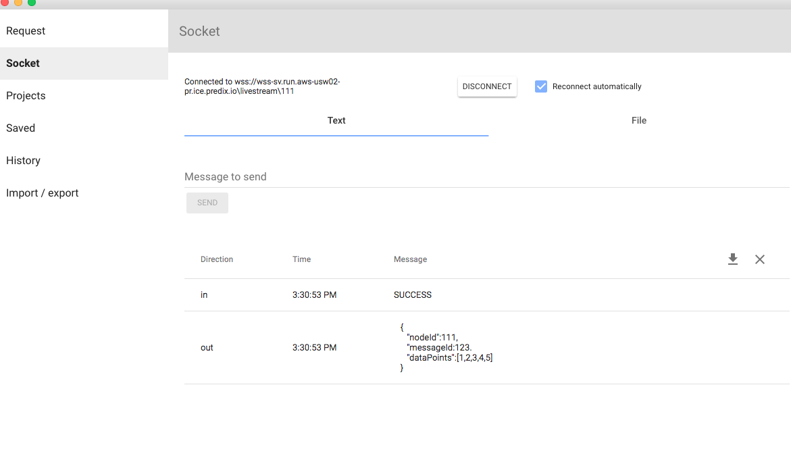
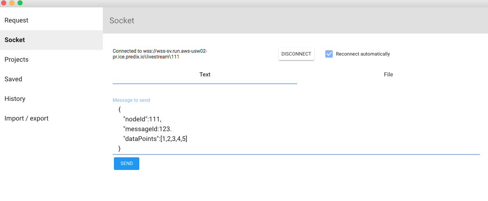
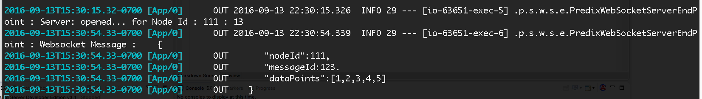

# predix-webwebsocket-server
Websocket server to listen and broadcast data

   ```  
git clone 
cd predix-websocket-server
mvn clean package
cf push
   ```  

Use websocket client to push data to the websocket 
   ```  
   wss://wss-sv.run.aws-usw02-pr.ice.predix.io/lifestream/111
   {
      "nodeId":111,
      "messageId:123.
      "dataPoints":[1,2,3,4,5]
   }
   ```  
      
 
 

Log
 


